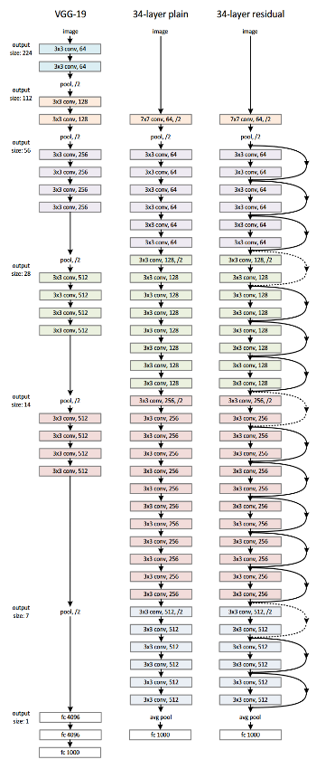
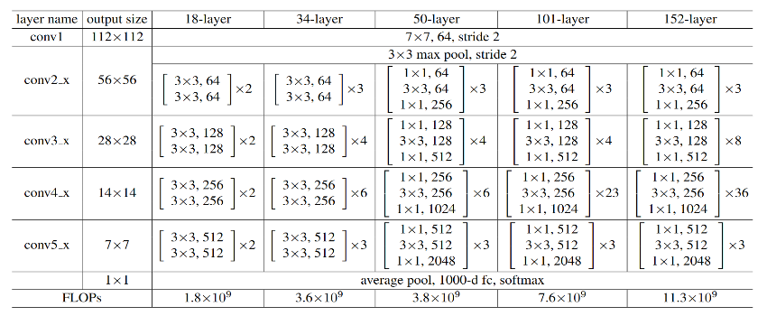

# Residual Networks(ResNet)

We use and explain Resnet50 architecture in this repository

## Resnets

The original ResNet architecture was ResNet-34, which comprised 34 weighted layers. It provided a novel way to  
add more convolutional layers to a CNN, without running into the vanishing gradient problem, using the concept of 
shortcut connections. A shortcut connection “skips over” some layers, converting a regular network to a residual network.

The regular network was based on the VGG neural networks (VGG-16 and VGG-19)—each convolutional network had  
a 3×3 filter. However, a ResNet has fewer filters and is less complex than a VGGNet. A 34-layer ResNet can achieve  
a performance of 3.6 billion FLOPs, and a smaller 18-layer ResNet can achieve 1.8 billion FLOPs, which is significantly 
faster than a VGG-19 Network with 19.6 billion FLOPs (read more in the ResNet paper, He et, al, 2015).

The ResNet architecture follows two basic design rules. First, the number of filters in each layer is the same depending 
on the size of the output feature map. Second, if the feature map’s size is halved, it has double the number of filters 
to maintain the time complexity of each layer.

## Resnet50

ResNet-50 has an architecture based on the model depicted above, but with one important difference. The 50-layer ResNet 
uses a bottleneck design for the building block. A bottleneck residual block uses 1×1 convolutions, known as a  
“bottleneck”, which reduces the number of parameters and matrix multiplications. This enables much faster training of 
each layer. It uses a stack of three layers rather than two layers.

The 50-layer ResNet architecture includes the following elements, as shown in the table below:

- A 7×7 kernel convolution alongside 64 other kernels with a 2-sized stride.
- A max pooling layer with a 2-sized stride.
- 9 more layers—3×3,64 kernel convolution, another with 1×1,64 kernels, and a third with 1×1,256 kernels. These 3 layers are repeated 3 times.
- 12 more layers with 1×1,128 kernels, 3×3,128 kernels, and 1×1,512 kernels, iterated 4 times.
- 18 more layers with 1×1,256 cores, and 2 cores 3×3,256 and 1×1,1024, iterated 6 times.
- 9 more layers with 1×1,512 cores, 3×3,512 cores, and 1×1,2048 cores iterated 3 times.

(up to this point the network has 50 layers)

- Average pooling, followed by a fully connected layer with 1000 nodes, using the softmax activation function.

# Datasets

- In this project we use [ImageNet2012](https://www.image-net.org/download.php).

- And we use [oxford_iiit_pet](https://www.tensorflow.org/datasets/catalog/oxford_iiit_pet) dataset from tensorflow: 
  The Oxford-IIIT pet dataset is a 37 category pet image dataset with roughly 200 images for each class.  
  The images have large variations in scale, pose and lighting. All images have an associated ground truth annotation of breed.

# Installation

1. Install python

- requirement version 3.x **x = {7,8,9, 10}**

2. Create virtual environment

- pip install virtualenv
- python -m venv {name of virtual environment}
- activate it 
- 1. On Windows: C:/path to your env/Scripts/activate
- 2. On Linux: path to your env/bin/activate

3. `pip install -r requirements.txt`

# Features

### Deep Learning

- architectures are built using [tensorflow](https://github.com/tensorflow/tensorflow.git)
- run in colab 
